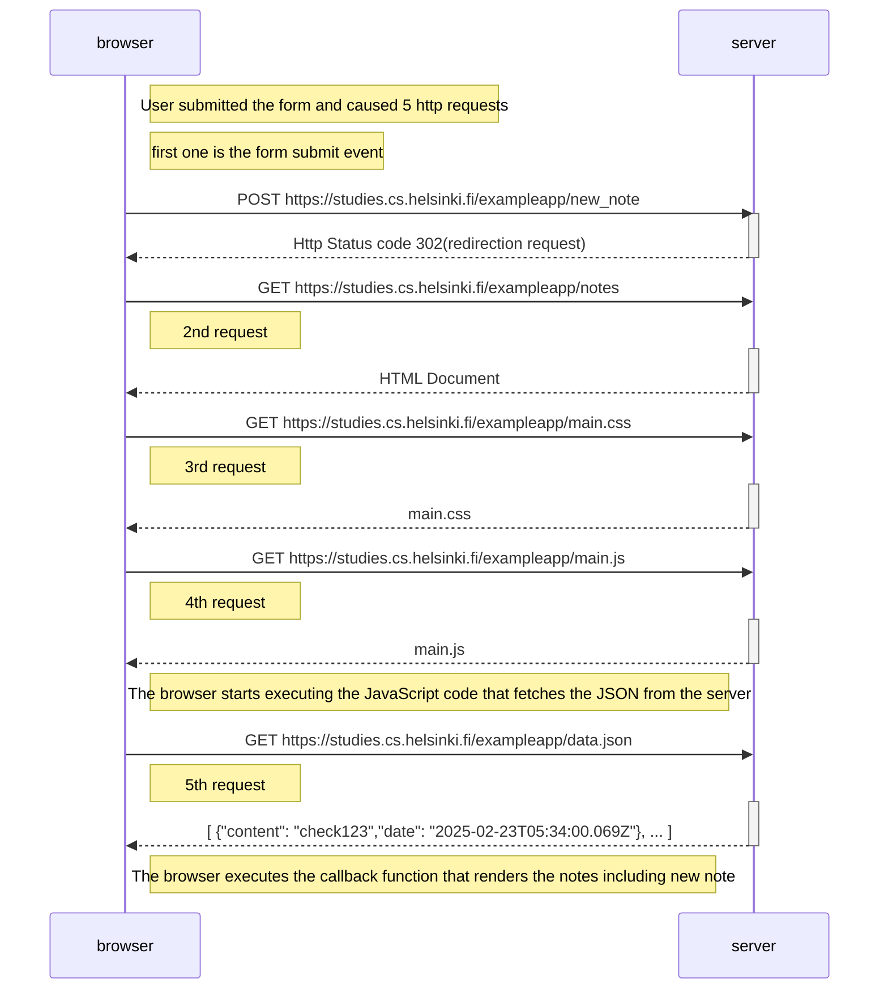

```mermaid 
sequenceDiagram
    participant browser
    participant server
    
    Note right of browser: User submitted the form and caused 5 http requests
    Note right of browser: first one is the form submit event
    browser->>server:   POST https://studies.cs.helsinki.fi/exampleapp/new_note
    activate server
   
    server-->>browser: Http Status code 302(redirection request)
    deactivate server
    
    
    browser->>server: GET https://studies.cs.helsinki.fi/exampleapp/notes
     Note right of browser: 2nd request
    activate server
    server-->>browser: HTML Document
    deactivate server
    
    browser->>server: GET https://studies.cs.helsinki.fi/exampleapp/main.css
     Note right of browser: 3rd request
    activate server
    server-->>browser: main.css
    deactivate server

    browser->>server: GET https://studies.cs.helsinki.fi/exampleapp/main.js
     Note right of browser: 4th request
    activate server
    server-->>browser: main.js
    deactivate server

     Note right of browser: The browser starts executing the JavaScript code that fetches the JSON from the server
    
    browser->>server: GET https://studies.cs.helsinki.fi/exampleapp/data.json
     Note right of browser: 5th request
    activate server
    server-->>browser: [ {"content": "check123","date": "2025-02-23T05:34:00.069Z"}, ... ]
    deactivate server    

    Note right of browser: The browser executes the callback function that renders the notes including new note 
```

